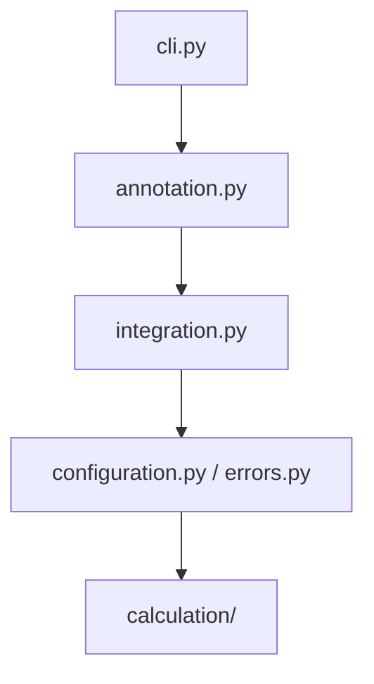

# Architecture

`apb-fasta` is a thin composition layer. It owns no FASTA parsing, no peptide matching, and no result persistence — it owns the *boundary* between them.

## Ownership

| Concern | Owner |
| --- | --- |
| FASTA reading, header interpretation, classification | `protein_fasta` |
| Peptide-to-protein matching (Aho-Corasick) | `prozor` |
| Result reading, writing, level and axis structure | `apb2` |
| Translating between the two, and the operation lifecycle | `apb_fasta` |

## Modules

- `annotation.py` — the public dataset-and-protein-bound lifecycle: `FastaAnnotationParser` and `FastaAnnotationResult`
- `integration.py` — the **only** module that reads or writes APB2 result values; extracts inputs, validates output names, and builds the deep replacement
- `calculation/` — pure Polars in, pure Polars out; imports no APB2 and no storage framework
- `configuration.py` / `errors.py` — user-selected behavior and the single expected-failure type
- `cli.py` — composes `protein_fasta`, APB2 result I/O, and the lifecycle; holds no logic of its own

## Enforced import direction

The layering above is a checked contract, not a convention. [`.importlinter`](https://github.com/anndata-omics-bridge/apb-fasta/blob/main/.importlinter) declares it:

- an exhaustive `layers` contract over `cli → annotation → integration → configuration | errors → calculation`
- a `forbidden` contract stopping `apb_fasta.calculation` from importing `apb2`, `anndata`, `mudata`, or `pandas`

`make architecture` runs `lint-imports` and is part of `make check`, so an upward or sideways import fails the build.

## Why calculations are isolated

Keeping `calculation/` free of APB2 and storage types means the matching and protein-group logic is testable against plain frames, and a change to APB2's result layout touches exactly one module — `integration.py`.

## Immutability

`FastaAnnotationParser` is a frozen dataclass; so are the parameters, the result, and every report. Each operation deep-copies the input result and validates every output name before writing anything. A refused operation leaves the input untouched.
