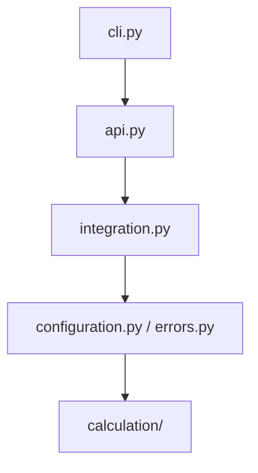

# Architecture

`apb-fasta` is a thin composition layer. It owns no FASTA parsing, no peptide matching, and no result persistence — it owns the *boundary* between them.

## Ownership

| Concern | Owner |
| --- | --- |
| FASTA reading, header interpretation, classification | `protein_fasta` |
| Peptide-to-protein matching (Aho-Corasick) | `prozor` |
| Result reading, writing, level and axis structure | `apb2` |
| Translating between the two, and the operation lifecycle | `apb_fasta` |

## Modules

```mermaid
graph TD
    cli[cli.py]
    api[api.py]
    integration[integration.py]
    config[configuration.py / errors.py]
    calculation[calculation/]

    cli --> api
    api --> integration
    integration --> config
    config --> calculation
```

- `api.py` — the public protein-bound lifecycle: `FastaAnnotator`, which `read()` builds from FASTA files through protein_fasta, and `FastaAnnotationResult`
- `integration.py` — the **only** module that reads or writes APB2 result values; extracts inputs, validates output names, and builds the deep replacement
- `calculation/` — pure Polars in, pure Polars out; imports no APB2 and no storage framework
- `configuration.py` / `errors.py` — user-selected behavior and the single expected-failure type
- `cli.py` — composes APB2 result I/O and the lifecycle; holds no logic of its own

## Enforced import direction

The layering above is a checked contract, not a convention. [`.importlinter`](https://github.com/anndata-omics-bridge/apb-fasta/blob/main/.importlinter) declares it:

- an exhaustive `layers` contract over `cli → api → integration → configuration | errors → calculation`
- a `forbidden` contract stopping `apb_fasta.calculation` from importing `apb2`, `anndata`, `mudata`, or `pandas`

`make architecture` runs `lint-imports` and is part of `make check`, so an upward or sideways import fails the build.

## Why calculations are isolated

Keeping `calculation/` free of APB2 and storage types means the matching and protein-group logic is testable against plain frames, and a change to APB2's result layout touches exactly one module — `integration.py`.

## Verification execution

Peptide verification normalizes feature sequences with Polars, searches distinct peptides across all levels once through Prozor, and uses native grouping and ordered joins to expand the results back to each feature axis. Reported protein assignments are split and resolved once per distinct assignment, rather than once per feature. Only peptide strings and minimal protein records cross the matching boundary; the complete protein metadata frame is not converted into Python row dictionaries.

Protein record identity is separate from the displayed identifier: two FASTA records with the same ID remain two matching proteins, and overlapping occurrences remain separate match sites. Repeated reported members retain their multiplicity. A missing assignment column produces null assignment diagnostics; an existing column with blank or missing values produces zero counts. Neither matching backend selection nor persisted output schemas change.

Measure `verify_peptides` separately from input loading and output writing. Concurrent workflow jobs, protein database size and unique peptide count affect elapsed time; vendor input bytes alone do not describe verification cost.

## Immutability

`FastaAnnotator` validates and binds its protein frame at construction, then accepts each canonical APB2 result explicitly. The parameters, result, and every report are frozen data values. Each operation deep-copies its input result and validates every output name before writing anything. A refused operation leaves the input untouched.
